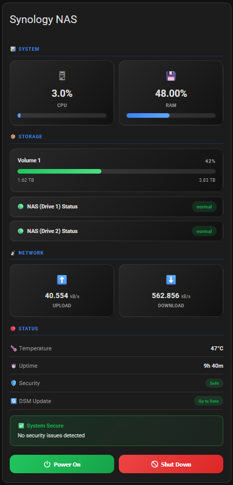
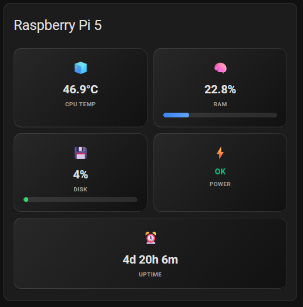

A collection of sleek, custom Lovelace dashboard cards for Home Assistant with built-in haptic feedback and visual editors.

## Installation

### HACS (Recommended)

1. Go to **HACS → Integrations → ⋮ → Custom repositories**
2. Add `https://github.com/duncas-run-it/Home-Assistant` with category **Integration**
3. Click **Install** under **HA Dashboard Cards**
4. **Restart Home Assistant**
5. Go to **Settings → Devices & Services → Add Integration**
6. Search for **HA Dashboard Cards** and click to add it
7. Refresh your browser — the cards will appear in the card picker

No manual resource setup required. The integration auto-registers the cards on startup.

### Manual Install

Copy the desired `.js` file to `<config>/www/`, then add it as a resource:
- **Settings → Dashboards → Resources → Add Resource**
- URL: `/local/synology-card.js` (or `/local/rapsberry-pi.js`)
- Type: **JavaScript Module**

## Cards

### Synology NAS Dashboard (`synology-card.js`)

A sleek Lovelace custom card for monitoring your Synology NAS. Displays CPU, RAM, storage, disk health, network, temperature, uptime, security status, and DSM update info.



| Entity | Attribute | Description |
|--------|-----------|-------------|
| `sensor.synology_cpu_load_total` | `state` | CPU usage percentage |
| `sensor.synology_memory_usage_real` | `state` | Memory usage percentage |
| `sensor.synology_storage_volume_*` | `volume_percentage_used` | Storage usage for each volume |
| `binary_sensor.synology_disk_sda_status` | `state` | Disk health (OK/ abnormal) |
| `sensor.synology_disk_sda_temp` | `state` or `temperature` | Disk temperature |
| `sensor.synology_network_up` | `state` (kbps) | Upload speed |
| `sensor.synology_network_down` | `state` (kbps) | Download speed |
| `sensor.synology_system_temp` | `state` or `temperature` | System temperature |
| `sensor.synology_status` | `state` | DSM status (Ready/Updating) |
| `sensor.synology_up_time` | `state` | Uptime (formatted by HA) |
| `binary_sensor.synology_security_status` | `state` | Security check (OK/Warning) |
| `binary_sensor.synology_update_available` | `state` | DSM update availability |

#### Card Configuration

| Name | Type | Required | Default | Description |
|------|------|----------|---------|-------------|
| `type` | string | yes | — | `custom:synology-card` |
| `title` | string | yes | — | Card header title |
| `cpu` | string | yes | — | CPU sensor entity ID |
| `memory` | string | yes | — | Memory sensor entity ID |
| `storage` | list | yes | — | List of storage volume entities |
| `disks` | list | yes | — | List of disk entities (name + sensors) |
| `network` | string | yes | — | Network sensor entity ID prefix |
| `temperature` | string | no | — | System temperature sensor entity ID |
| `uptime` | string | no | — | Uptime sensor entity ID |
| `security` | string | no | — | Security status binary sensor entity ID |
| `updatetime` | string | no | — | DSM update available binary sensor entity ID |
| `status` | string | no | — | DSM status sensor entity ID |

#### YAML Example

```yaml
type: custom:synology-card
title: Synology NAS
cpu: sensor.synology_cpu_load_total
memory: sensor.synology_memory_usage_real
storage:
  - sensor.synology_storage_volume_1
disks:
  - name: Disk 1
    entity: binary_sensor.synology_disk_sda_status
    temp: sensor.synology_disk_sda_temp
network: sensor.synology_network
temperature: sensor.synology_system_temp
uptime: sensor.synology_up_time
security: binary_sensor.synology_security_status
updatetime: binary_sensor.synology_update_available
status: sensor.synology_status
```

### Raspberry Pi Health Card (`rapsberry-pi.js`)

A clean and modern Lovelace custom card for monitoring your Raspberry Pi's vital signs. Displays CPU, RAM, storage, disk health, network, temperature, and more.



| Entity | Attribute | Description |
|--------|-----------|-------------|
| `sensor.cpu_temperature` | `state` | CPU temperature |
| `sensor.processor_use` | `state` | CPU usage percentage |
| `sensor.memory_use_percent` | `state` | Memory usage percentage |
| `sensor.disk_use_percent` | `state` | Storage usage percentage |
| `binary_sensor.uptime` | `state` | System status (Online/Offline) |

#### Card Configuration

| Name | Type | Required | Default | Description |
|------|------|----------|---------|-------------|
| `type` | string | yes | — | `custom:raspberry-pi` |
| `title` | string | yes | — | Card header title |
| `host` | string | yes | — | Device hostname or label |
| `cpu_temp` | string | yes | — | CPU temperature sensor entity ID |
| `cpu` | string | yes | — | CPU usage sensor entity ID |
| `memory` | string | yes | — | Memory usage sensor entity ID |
| `storage` | string | yes | — | Storage usage sensor entity ID |
| `status` | string | yes | — | System status binary sensor entity ID |
| `uptime` | string | no | — | Uptime sensor entity ID |

#### YAML Example

```yaml
type: custom:raspberry-pi
title: Raspberry Pi 4
host: k3s-master
cpu_temp: sensor.cpu_temperature
cpu: sensor.processor_use
memory: sensor.memory_use_percent
storage: sensor.disk_use_percent
status: binary_sensor.uptime
uptime: sensor.uptime
```

## License

MIT — see [LICENSE](LICENSE).
