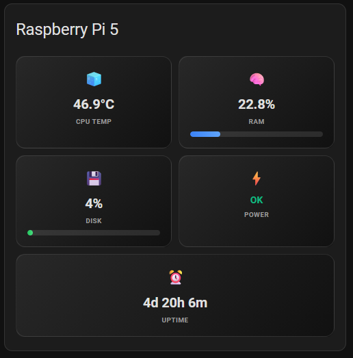

A collection of sleek, custom Lovelace dashboard cards for Home Assistant with built-in haptic feedback and visual editors.

## Installation

### HACS (Recommended)

1. Go to **HACS → Integrations → ⋮ → Custom repositories**
2. Add `https://github.com/duncas-run-it/Home-Assistant` with category **Integration**
3. Click **Install** under **HA Dashboard Cards**
4. **Restart Home Assistant**
5. Go to **Settings → Devices & Services → Add Integration**
6. Search for **HA Dashboard Cards** and click to add it
7. Refresh your browser — the cards will appear in the card picker

No manual resource setup required. The integration auto-registers the cards on startup.

### Manual Install

Manually copy the `.js` files from `custom_components/ha_dashboard_cards/www/` to `<config>/www/ha_dashboard_cards/`, then add them as resources:
- **Settings → Dashboards → Resources → Add Resource**
- URL: `/local/ha_dashboard_cards/truenas-card.js`
- URL: `/local/ha_dashboard_cards/rapsberry-pi.js`
- Type: **JavaScript Module**

## Cards

### TrueNAS CE Dashboard (`truenas-card.js`)

A Lovelace card for one TrueNAS pool and one primary network interface. It displays CPU, memory, pool usage, pool health, network traffic, temperature, uptime, disk/pool health, update state, and confirmed shutdown control. The card uses the `truenas-card` custom element and is registered automatically by the integration.

The card expects the current `truenas_ce` integration (TrueNAS CE 25.04+). Confirm the generated entity IDs in Home Assistant because migrations, custom names, and multiple TrueNAS instances can change them.

| Name | Type | Required | Description |
|------|------|----------|-------------|
| `type` | string | yes | `custom:truenas-card` |
| `title` | string | no | Card title; defaults to `TrueNAS` |
| `cpu_entity` | string | yes | TrueNAS CPU usage sensor |
| `memory_entity` | string | no | TrueNAS memory usage sensor |
| `volume_name` | string | no | Storage label; defaults to `Storage` |
| `volume_entity` | string | no | Pool size sensor used as the click target |
| `volume_used_entity` | string | no | Pool allocated sensor |
| `volume_total_entity` | string | no | Pool size sensor used to calculate usage |
| `disk_entities` | list | no | Pool-health binary sensors |
| `network_up_entity` | string | no | Primary interface TX sensor |
| `network_down_entity` | string | no | Primary interface RX sensor |
| `temperature_entity` | string | no | TrueNAS CPU temperature sensor |
| `uptime_entity` | string | no | TrueNAS uptime sensor; also the shutdown action target |
| `security_entity` | string | no | TrueNAS Disk/Pool issues problem sensor |
| `update_entity` | string | no | TrueNAS system update entity |
| `power_on_entity` | string | no | Existing button/switch target or Wake-on-LAN MAC |
| `shutdown_entity` | string | no | Uptime sensor targeted by `truenas_ce.system_shutdown` |

#### YAML Example

```yaml
type: custom:truenas-card
title: TrueNAS
cpu_entity: sensor.truenas_cpu_usage
memory_entity: sensor.truenas_memory_usage
volume_name: tank
volume_entity: sensor.truenas_pools_tank_size
volume_used_entity: sensor.truenas_pools_tank_allocated
volume_total_entity: sensor.truenas_pools_tank_size
disk_entities:
  - binary_sensor.truenas_pools_tank_healthy
network_up_entity: sensor.truenas_network_enp1s0_tx
network_down_entity: sensor.truenas_network_enp1s0_rx
temperature_entity: sensor.truenas_cpu_temperature
uptime_entity: sensor.truenas_uptime
security_entity: binary_sensor.truenas_disk_pool_issues
update_entity: update.truenas_system_update
shutdown_entity: sensor.truenas_uptime
```

### Raspberry Pi Health Card (`rapsberry-pi.js`)

A clean and modern Lovelace custom card for monitoring your Raspberry Pi's vital signs. Displays CPU, RAM, storage, disk health, network, temperature, and more.



| Entity | Attribute | Description |
|--------|-----------|-------------|
| `sensor.cpu_temperature` | `state` | CPU temperature |
| `sensor.processor_use` | `state` | CPU usage percentage |
| `sensor.memory_use_percent` | `state` | Memory usage percentage |
| `sensor.disk_use_percent` | `state` | Storage usage percentage |
| `binary_sensor.uptime` | `state` | System status (Online/Offline) |

#### Card Configuration

| Name | Type | Required | Default | Description |
|------|------|----------|---------|-------------|
| `type` | string | yes | — | `custom:raspberry-pi` |
| `title` | string | yes | — | Card header title |
| `host` | string | yes | — | Device hostname or label |
| `cpu_temp` | string | yes | — | CPU temperature sensor entity ID |
| `cpu` | string | yes | — | CPU usage sensor entity ID |
| `memory` | string | yes | — | Memory usage sensor entity ID |
| `storage` | string | yes | — | Storage usage sensor entity ID |
| `status` | string | yes | — | System status binary sensor entity ID |
| `uptime` | string | no | — | Uptime sensor entity ID |

#### YAML Example

```yaml
type: custom:raspberry-pi
title: Raspberry Pi 4
host: k3s-master
cpu_temp: sensor.cpu_temperature
cpu: sensor.processor_use
memory: sensor.memory_use_percent
storage: sensor.disk_use_percent
status: binary_sensor.uptime
uptime: sensor.uptime
```

## License

MIT — see [LICENSE](LICENSE).
